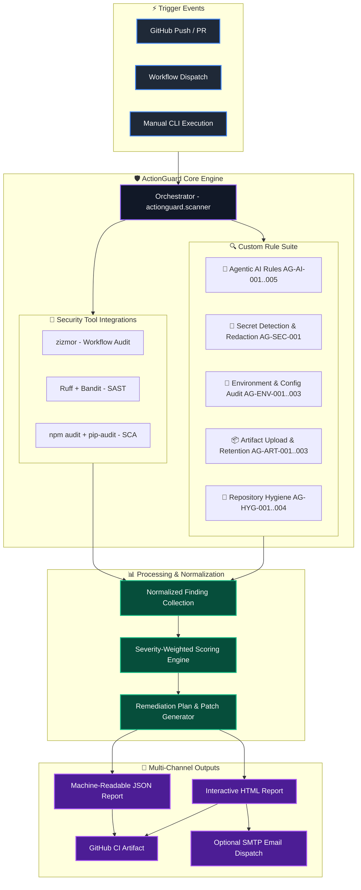
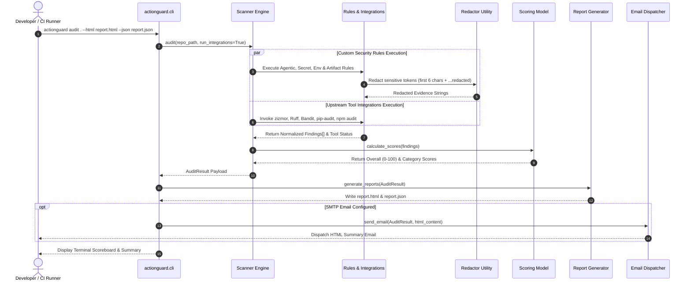
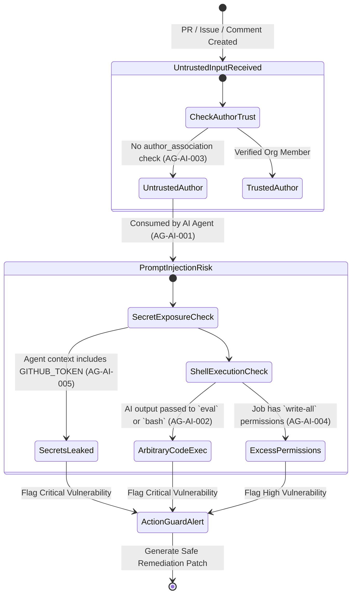
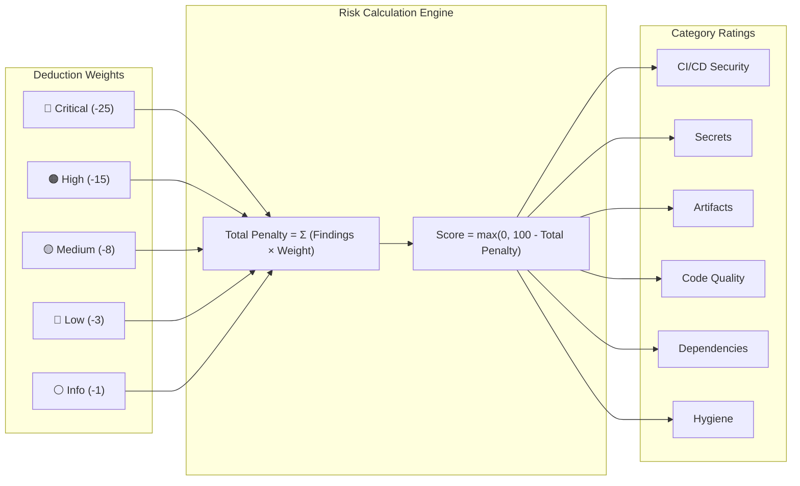

<div align="center">

# 🛡️ ActionGuard AutoAudit

### Next-Gen Automated GitHub CI/CD Security Auditing & Remediation Engine

**Detection → Evidence → Severity → Patch Preview → HTML/JSON Reports → Email Delivery**

<br />

[](https://www.python.org/)
[](https://github.com/zizmorcore/zizmor)
[](.github/workflows/actionguard-autoaudit.yml)
[](tests/)
[](https://docs.astral.sh/ruff/)
[](https://bandit.readthedocs.io/)
[](LICENSE)
[](https://github.com/Tayab-Ahamed/Actionguard-Autoaudit)

<br />

```text
 ╔═════════════════════════════════════════════════════════════════════════════╗
 ║  🤖 AGENTIC AI PROTECTION  •  🔑 SECRET REDACTION  •  📄 ENV FILE AUDIT     ║
 ║  📦 ARTIFACT GOVERNANCE    •  📊 RISK SCORING      •  📝 RESPONSIVE REPORTS ║
 ╚═════════════════════════════════════════════════════════════════════════════╝
```

</div>

---

## 📖 Executive Summary

**ActionGuard AutoAudit** is a state-of-the-art security auditing engine designed specifically for modern GitHub CI/CD pipelines and **agentic AI workflows**. It builds upon [**zizmor**](https://github.com/zizmorcore/zizmor) by introducing specialized detection rules for AI agent threats, secret leaks, risky configuration files, and artifact retention vulnerabilities.

ActionGuard normalizes heterogeneous security findings from multiple tools (zizmor, Ruff, Bandit, npm audit, pip-audit) into a unified risk model, delivering actionable remediation plans complete with safe patch previews.

> 🔒 **Safety Guarantee**: ActionGuard **never** mutates code automatically, deletes configuration files, rotates credentials, or changes production permissions without human oversight. It reports, redacts, and recommends—keeping developers strictly in control.

---

## ✨ Key Features & Capabilities

| Feature Area | Description | Highlights |
|---|---|---|
| 🤖 **Agentic AI Security** | Detects untrusted inputs reaching AI agents, AI outputs executed as shell scripts, and missing trust checks. | 5 dedicated rules (`AG-AI-001`–`AG-AI-005`) |
| 🔑 **Secret Detection** | Deep regex scanning for GitHub PATs, AWS keys, OpenAI/Google tokens, JWTs, DB URIs, and private keys. | 100% automated redaction (`6-char prefix + ...redacted`) |
| 📄 **Env & Config Audit** | Identifies committed `.env`, `.pem`, `.key`, and credential files, alongside missing `.gitignore` rules. | Prevents accidental leak of sensitive configuration files |
| 📦 **Artifact Governance** | Detects full-repository artifact uploads, sensitive path inclusions, and excessive retention (> 30 days). | Mitigates data exfiltration & storage bloat risks |
| 🔗 **Tool Orchestration** | Seamlessly wraps **zizmor**, **Ruff**, **Bandit**, **pip-audit**, and **npm audit**. | Graceful fallback if any tool is uninstalled/unavailable |
| 📊 **Normalized Risk Model** | Calculates category scores (0–100) and an overall security score from severity-weighted rules. | Standardized risk metrics across all pipelines |
| 📝 **Rich Reporting** | Generates self-contained, responsive **HTML** reports (dark-mode ready) and structured **JSON**. | Executive dashboard + machine-readable findings |
| 📧 **Email Notifications** | Optional SMTP dispatch of HTML executive summaries directly to security engineers. | Silent fail-safe execution if SMTP secrets are absent |

---

## 🏗️ System Architecture & Workflow Diagrams

### 1. High-Level Architecture Topology



---

### 2. Finding Flow & Execution Sequence



---

### 3. Agentic AI Threat Detection Lifecycle



---

## 🔍 Comprehensive Detection Rules Catalog

### 🤖 Agentic AI Security Rules

| Rule ID | Category | Severity | Detection Target | Description & Mitigation |
|---|---|:---:|---|---|
| `AG-AI-001` | Agentic AI | 🔴 **Critical** | Untrusted Input to AI | Triggers when untrusted PR/issue/comment body is passed into an AI agent step without sanitization. |
| `AG-AI-002` | Agentic AI | 🔴 **Critical** | AI Output Shell Execution | Detects AI response outputs piped directly into `eval`, `bash`, `sh`, or executable steps. |
| `AG-AI-003` | Agentic AI | 🟠 **High** | Missing Author Association | Flags comment-triggered workflows lacking `github.event.comment.author_association` verification. |
| `AG-AI-004` | Agentic AI | 🔴 **Critical** | Over-Privileged Agent Job | Detects AI workflows executing with write permissions (`write-all` or `pull-requests: write`). |
| `AG-AI-005` | Agentic AI | 🔴 **Critical** | Secrets Exposed to Agent | Flags high-privilege secrets (`GITHUB_TOKEN`, API keys) injected into untrusted AI agent contexts. |

---

### 🔑 Secret Detection & Environment Rules

| Rule ID | Category | Severity | Detection Target | Description & Mitigation |
|---|---|:---:|---|---|
| `AG-SEC-001` | Secrets | 🔴 **Critical** | Hardcoded Credentials | Scans for GitHub PATs (`ghp_`), AWS keys (`AKIA`), OpenAI keys (`sk-`), JWTs, DB URIs, and Private Keys. Always redacted. |
| `AG-ENV-001` | Environment | 🔴 **Critical** | Committed Sensitive Files | Flags committed `.env`, `.env.production`, `*.pem`, `*.key`, `service-account.json` files. |
| `AG-ENV-002` | Environment | 🟡 **Medium** | Missing `.gitignore` | Warns if the repository lacks a `.gitignore` file entirely. |
| `AG-ENV-003` | Environment | 🟡 **Medium** | Incomplete `.gitignore` | Detects `.gitignore` files that omit standard secret patterns (`.env`, `*.key`). |

---

### 📦 Artifact Upload & Governance Rules

| Rule ID | Category | Severity | Detection Target | Description & Mitigation |
|---|---|:---:|---|---|
| `AG-ART-001` | Artifacts | 🟠 **High** | Whole-Repo Upload | Flags `actions/upload-artifact` steps targeting root `path: .` or `path: ./`. |
| `AG-ART-002` | Artifacts | 🟠 **High** | Sensitive File Upload | Detects artifact paths containing sensitive directories (`.env`, `.git`, `credentials`). |
| `AG-ART-003` | Artifacts | 🟠 **High** | Excessive Retention Window | Warns when artifact `retention-days` exceeds 30 days (reducing exposure window). |

---

### 🧹 Repository Governance & Integrations

| Rule ID / Source | Category | Severity | Detection Target | Description & Mitigation |
|---|---|:---:|---|---|
| `AG-HYG-001` | Governance | 🔵 **Low** | Missing Governance Docs | Checks for presence of `README.md`, `LICENSE`, `SECURITY.md`, and `CODEOWNERS`. |
| `AG-HYG-002` | Governance | 🔵 **Low** | Missing CI Workflows | Verifies that at least one GitHub Actions workflow exists under `.github/workflows/`. |
| `AG-HYG-003` | Governance | 🔵 **Low** | Missing Dependency Locks | Checks for `poetry.lock`, `Pipfile.lock`, `package-lock.json`, or `yarn.lock`. |
| `ZIZMOR-*` | CI/CD | Mapped | Upstream zizmor Findings | Normalizes all native zizmor workflow security findings into ActionGuard models. |
| `RUFF-* / BANDIT-*` | Code Quality | Mapped | Python Code SAST | Imports linting and static analysis findings from Ruff and Bandit. |
| `AUDIT-*` | Dependencies | Mapped | Dependency Vulnerabilities | Captures known security advisories from `pip-audit` and `npm audit`. |

---

## 📊 Risk Scoring Model

ActionGuard calculates security scores on a **0 to 100** scale. Every repository starts at **100 points**, with penalties deducted based on finding severities floored at zero.



---

## 🚀 Quick Start Guide

### 1. Installation

```bash
# Clone the repository
git clone https://github.com/Tayab-Ahamed/Actionguard-Autoaudit.git
cd Actionguard-Autoaudit

# Create virtual environment & activate
python -m venv .venv
source .venv/bin/activate  # On Windows: .venv\Scripts\activate

# Install ActionGuard in editable mode with development dependencies
pip install -e ".[dev]"

# Install optional external security tools for full coverage
pip install zizmor ruff bandit pip-audit
```

---

### 2. Running an Audit

```bash
# Perform a complete repository security audit
actionguard audit . \
  --html reports/actionguard-report.html \
  --json reports/actionguard-report.json
```

```bash
# Run audit via python module syntax (alternative)
python -m actionguard.cli audit . --html report.html --json report.json
```

---

### 3. Re-rendering Reports

If you already have a generated JSON report and want to re-render the HTML report with styling adjustments:

```bash
actionguard report \
  --json reports/actionguard-report.json \
  --html reports/actionguard-report.html
```

---

## 🧰 CLI Command Reference

```text
usage: actionguard [-h] {audit,scan,report} ...

ActionGuard AutoAudit CLI - GitHub CI/CD & Agentic AI Security Engine

positional arguments:
  {audit,scan,report}
    audit              Run full audit (rules + integrations) and generate reports
    scan               Alias for 'audit'
    report             Re-render HTML report from existing JSON report

options:
  -h, --help           show this help message and exit
```

### Audit Command Arguments (`actionguard audit`)

| Option / Flag | Description | Default |
|---|---|---|
| `path` | Target repository directory to scan | `.` (current directory) |
| `--html PATH` | Output filepath for the self-contained HTML report | `None` (stdout summary only) |
| `--json PATH` | Output filepath for machine-readable JSON payload | `None` |
| `--email` | Enable SMTP email delivery of the HTML report | `False` |
| `--no-integrations` | Skip external tools (`zizmor`, `Ruff`, `Bandit`, etc.) | `False` |

---

## ⚙️ Configuration & Email Notifications

ActionGuard supports automated SMTP email dispatch of HTML executive summaries. Email delivery triggers **only** when all required SMTP environment variables are populated.

### Environment Variables Matrix

| Variable | Required | Default Value | Description |
|---|:---:|---|---|
| `MAIL_USERNAME` | ✅ | *None* | Sender email address / SMTP username |
| `MAIL_PASSWORD` | ✅ | *None* | SMTP password or App Password |
| `REPORT_TO_EMAIL` | ✅ | *None* | Recipient email address |
| `MAIL_HOST` | ➖ | `smtp.gmail.com` | SMTP server hostname |
| `MAIL_PORT` | ➖ | `465` | SMTP port (SSL) |

> ℹ️ If SMTP environment variables are missing, email delivery is **silently skipped** without failing the audit.

---

## 🤖 GitHub Actions CI/CD Pipeline Integration

Integrate ActionGuard into your GitHub repository using `.github/workflows/actionguard-autoaudit.yml`:

```yaml
name: ActionGuard AutoAudit

on:
  push:
    branches: [main]
  pull_request:
  workflow_dispatch:

permissions:
  contents: read

jobs:
  audit:
    runs-on: ubuntu-latest
    timeout-minutes: 15

    steps:
      - name: Checkout Codebase
        uses: actions/checkout@v4
        with:
          persist-credentials: false

      - name: Set up Python
        uses: actions/setup-python@v5
        with:
          python-version: '3.12'
          cache: pip

      - name: Install ActionGuard & Scanners
        run: |
          pip install -e '.[dev]' zizmor

      - name: Run Test Suite
        run: pytest -q

      - name: Execute Security Audit
        env:
          MAIL_USERNAME: ${{ secrets.MAIL_USERNAME }}
          MAIL_PASSWORD: ${{ secrets.MAIL_PASSWORD }}
          REPORT_TO_EMAIL: ${{ secrets.REPORT_TO_EMAIL }}
        run: |
          python -m actionguard.cli audit . \
            --html reports/actionguard-report.html \
            --json reports/actionguard-report.json \
            --email

      - name: Upload Security Reports
        if: always()
        uses: actions/upload-artifact@v4
        with:
          name: actionguard-audit-reports
          path: |
            reports/actionguard-report.html
            reports/actionguard-report.json
          retention-days: 7
```

---

## 📁 Repository Structure

```text
Actionguard-Autoaudit/
├── .github/
│   └── workflows/
│       └── actionguard-autoaudit.yml  # Least-privilege CI workflow
├── actionguard/
│   ├── __init__.py
│   ├── cli.py                        # CLI entrypoint (audit, scan, report)
│   ├── config.py                     # Size limits, timeouts, skip patterns
│   ├── email_sender.py               # SMTP email delivery utility
│   ├── models.py                     # Finding, Severity & AuditResult dataclasses
│   ├── remediation.py                # Prioritized remediation checklist builder
│   ├── report.py                     # HTML & JSON report materialization
│   ├── scanner.py                    # Core scanner & integration orchestrator
│   ├── scoring.py                    # Severity-weighted risk scoring engine
│   ├── rules/                        # Custom security rule engine
│   │   ├── agentic.py                # 5 Agentic AI security rules (AG-AI-*)
│   │   ├── artifacts.py              # Artifact upload & retention checks (AG-ART-*)
│   │   ├── env_files.py              # Committed env file & gitignore audits (AG-ENV-*)
│   │   ├── hygiene.py                # Repository governance checks (AG-HYG-*)
│   │   └── secrets.py                # Regex secret scanner & redactor (AG-SEC-*)
│   ├── integrations/                 # External tool integration wrappers
│   │   ├── bandit.py                 # SAST for Python security
│   │   ├── common.py                 # Subprocess runner & status helpers
│   │   ├── npm_audit.py              # JS dependency audit wrapper
│   │   ├── pip_audit.py              # Python dependency vulnerability checker
│   │   ├── ruff.py                   # Fast Python linter wrapper
│   │   └── zizmor.py                 # GitHub Actions workflow auditor
│   └── utils/                        # Utility helpers
├── examples/                         # Vulnerable demo repository samples
├── reports/                          # Generated HTML & JSON security reports
├── slides/                           # ActionGuard presentation materials
├── tests/                            # Comprehensive Pytest test suite
│   ├── test_agentic_rules.py
│   ├── test_artifact_rules.py
│   ├── test_env_rules.py
│   ├── test_scoring.py
│   └── test_secret_redaction.py
├── CODEOWNERS                        # Code ownership rules
├── LICENSE                           # Standard MIT License
├── NOTICE.md                         # Upstream zizmor attribution notice
├── pyproject.toml                    # Package metadata & tool configurations
├── README.md                         # Project documentation
├── requirements.txt                  # Direct python dependencies
├── SECURITY.md                       # Responsible disclosure policy
└── VALIDATION.md                     # Verification & audit test results
```

---

## 🔒 Security & Data Redaction Model

1. **Secret Masking**: Any matched credential or secret string is automatically truncated to its first 6 characters followed by `...redacted` before being stored in findings or output reports.
2. **File Exclusions**: Scanners skip binary files, files larger than 1 MB, generated reports (`reports/`), and standard dependency/build paths (`.venv`, `node_modules`, `.git`).
3. **Safe Recommendations**: Findings explicitly categorize suggested fixes into **auto-fix-safe** and **manual-review-required** changes.

---

## 🧪 Demonstration & Validation

Test ActionGuard against the bundled intentionally-vulnerable demonstration repository:

```bash
actionguard audit examples/demo-vulnerable-repo \
  --html reports/demo-report.html \
  --json reports/demo-report.json
```

**Expected Vulnerabilities Detected**:
- AI-generated script execution (`AG-AI-002`)
- Over-privileged workflow permissions (`AG-AI-004`)
- Untrusted comment triggers (`AG-AI-003`)
- Hardcoded secrets exposure (`AG-SEC-001`)
- Whole-repository artifact upload (`AG-ART-001`)
- Excessive retention window (`AG-ART-003`)

---

## 🙏 Upstream Attribution

ActionGuard AutoAudit leverages [**zizmor**](https://github.com/zizmorcore/zizmor) as its core GitHub Actions analysis engine. For full licensing details and attribution, refer to [`NOTICE.md`](NOTICE.md).

---

## 📜 License & Support

Distributed under the **MIT License**. See [`LICENSE`](LICENSE) for complete terms.  
For security vulnerability reports, please consult [`SECURITY.md`](SECURITY.md).

---

<div align="center">

**ActionGuard AutoAudit** • *Empowering Secure GitHub Actions & Agentic AI Workflows*

</div>
